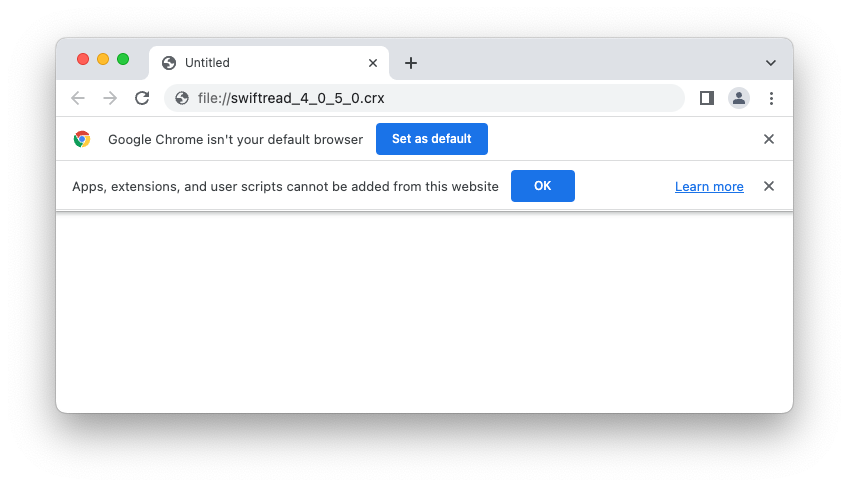

As I was browsing around the internet, I though I give "Swiftread" another chance, since I needed to read a couple of articles and thought this could save me some time. Oh boy, was I wrong.

When I started Swiftread I noticed, that the keyboard shortcuts I was used to no longer worked. I could open Swiftread using ⌥V and start the reader using SPACE, but that was about it. What is going on?

So I went into the settings to find out, whether the keybindings might have changed. But no, they were all still the same. What had changed was the major version number (v5) and with it the monetization strategy. Before, only new (and what I consider advanced) features, such as text-to-speech were locked behind the PRO subscription paywall. Now, every little piece of customization requires the PRO subscription. It is obvious that the author doesn't want to provide a useful product for free anymore. Personally, I think that is fine, good things cost money. What irritated me was, that *core-functionality, previously freely available, now was moved behind the paywall.* And not only font and color customizations, but also really basic things like *keyboard shortcuts*.

I was outraged. But ok, whenever a new version doesn't improve on the product, we are free to stick with the old version, right? Right?... Wrong!

The Chrome Extension Store doesn't provide any versioning at all and auto-updates every extension. So, following the official way, there is no way to opt-out of such "improvements" by the extension authors.

> Quick aside: I stumbled upon the same problem recently when trying to acquire the most recent version of Day One Classic (1.10.7). I'm simply not ready to move to the subscription-based Day One with a $40 price tag (per year) when I'm not even sure I'm going to stick with journaling this time. In principal, the app store makes this possible, but only if the developers didn't update the new version "over" the old one and instead created a new app for that. I don't like that the control over which version I'm using lies with the developer or the platform vendor, not me.
>
> Back to Swiftread...

So what did I do? I looked for old versions of the extension on the internet and [crx4chrome.com](https://www.crx4chrome.com/) came to the rescue. But how do I install those extensions when Chrome says

OK? OK??? No, not OK! There is a reason you are not my default browser, Chrome!

So we need to unpack the CRX, which I learned is a glorified zip with a little bit of magic[^1]. No problem: [Poikilos/uncrx](https://github.com/Poikilos/uncrx) did that beautifully (after a [minor fix of a syntax error](https://github.com/Poikilos/uncrx/pull/1)). Now I could load the unpacked extension into my browser using the extensions page in developer mode.

But wait: I have access to the source code now. That also means I can modify it however I want, right 😲😏.

So while I'm at it, I eliminated all those PRO upsell banners that stick out like a sore thumb in the UI. I discovered that some client-side features that are not available without a subscription, are kept server-side and are only pushed to the client with a valid license key. Clever ^^. I wonder if I could get a valid license for a month, save the payload received by the server and keep using it forever. But this surely crosses some line of what is allowed and ethical, so I won't pursue it further.

Ok, so finally loading the modified extension into the browser and voilà: I have Swiftread in its older, more basic but fully-functional and (for me) sufficient form back at my fingertips. Great!

[^1]: https://docs.fileformat.com/misc/crx/
