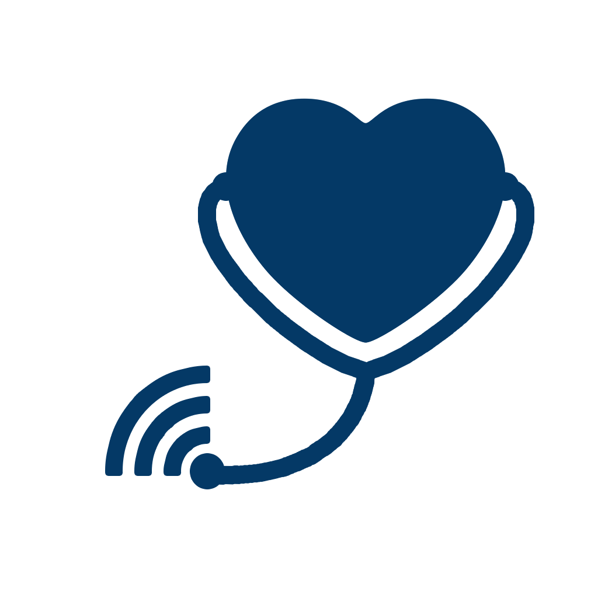

# Telemedicine TUM

## Summary

Telemedicine TUM makes the exchange of fitness data between athletes and sport scientists (or patients and their doctors) easier.

The iPhone app collects activity and workout data from HealthKit and allows the user to tag workouts with additional datapoints, such as a qualitative rating and perceived intensity of the workout.

The iPad app allows the sport scientist to keep track of his athlete's progress and performance over time. They may analyze and give feedback on past workouts, prescribe workouts with specific goals (such as a target time or distance) and keep track of their athlete's progress.

## My Role

The development team consisted of 5 people, including me. My main responsibilities included

* implementing the [Login Screen](#login-screen)
* making the [iPad app more responsive](#making-views-more-responsive)
* setting up the backend server
* iterating on design ideas (like our [app icon](#app-icon) and the [calendar view](#design-of-the-calendar-view))

### Login Screen

### Making Views more Responsive

### Design of the Calendar View

### App Icon

Iteration of the App Icon
 ->  -> 
